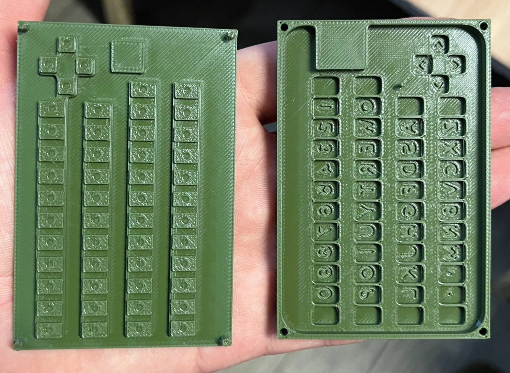
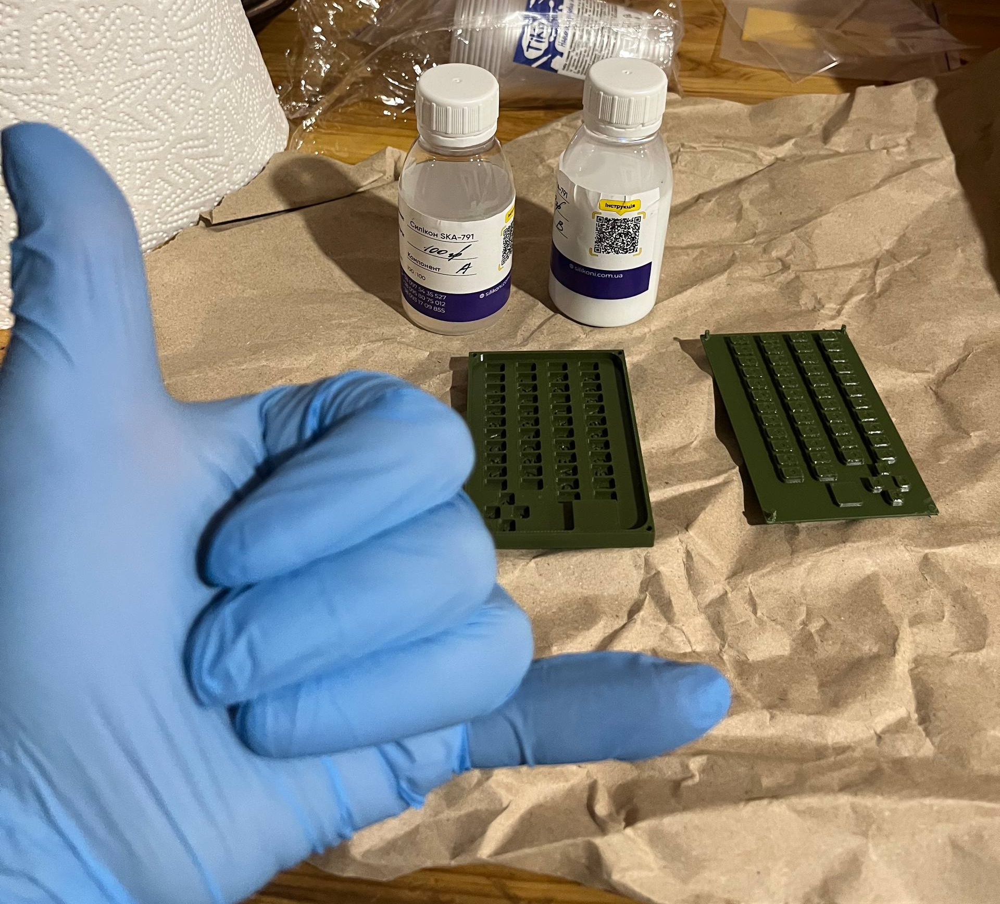
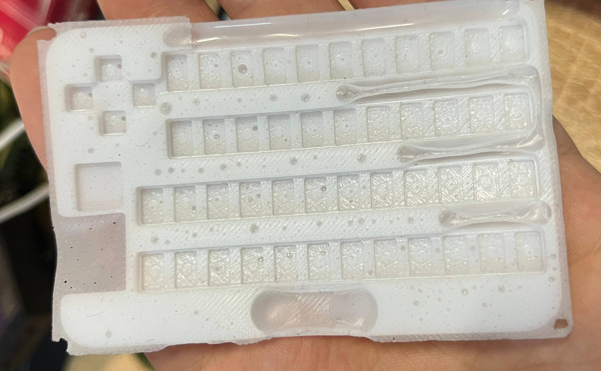
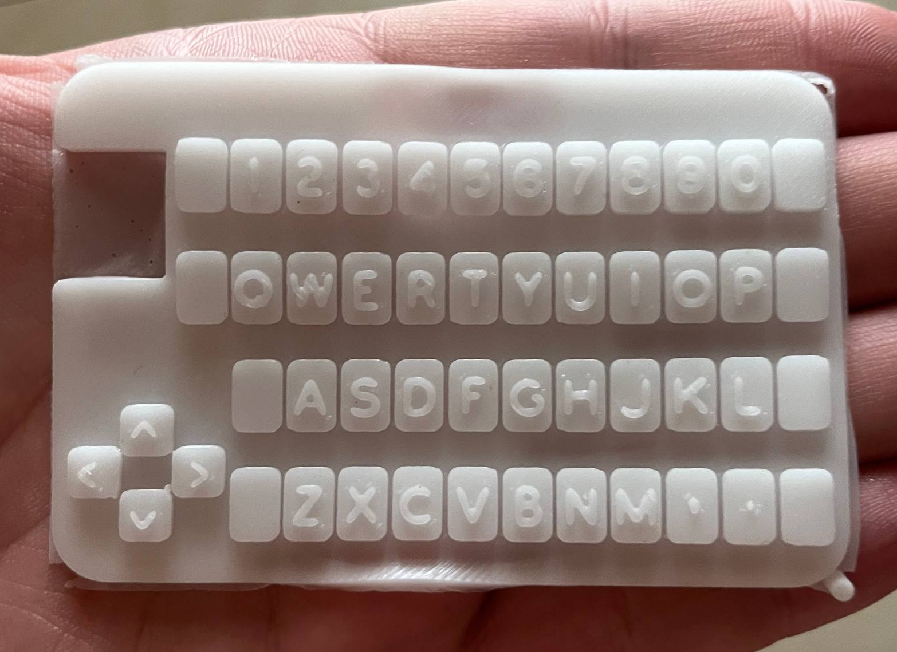

# CardKB Silicone Mold

I was looking for a tiny keyboard for my cyberdeck project. CardKB ticked all boxes. It's neat, small, and can be connected via i2c. Only issue - pressing those small buttons kinda hurts. So I've decided to make a silicone cover myself. Since I had no previous experience with either CAD modeling or working with silicone, I found this a great opportunity to learn and have some fun.

I found an amazing silicone cover model by Jason Febbraro on the [GrabCAD](https://grabcad.com/library/m5stack-cardkb-silicon-cover-1) website. Since then it was deleted for reasons unknown to me, but I was able to find it on the [Marathon](https://marathon-os.com/library/m5stack-cardkb-silicon-cover-6811a02743b4d50b11a59082) website. Jason did not specify the license by which his cover model is shared, so I assume it's public domain and include it in this repository in file [m5stack_cardkb_silicone_cover.step](m5stack_cardkb_silicone_cover.step).

Since mentioned above lack of experience with CAD software, I've used two of them. FreeCAD to edit the original cover model by removing lettering, which ended up in the [membrane_no_text.FCStd](membrane_no_text.FCStd) file. After that I exported it to [membrane_no_text.3mf](membrane_no_text.3mf) since this format can be imported in OpenSCAD. As a programmer, I adore this software since it allows me to do modeling with code, albeit with some limitations. My model for mold is available at [cardkb_mold.scad](cardkb_mold.scad) file. I also added lettering for some keys using the [Open Gorton](https://github.com/dakotafelder/open-gorton) font by dakotafelder.

Final model I've used for printing is available at the [cardkb_mold.stl](cardkb_mold.stl) file. After a bunch of iterations, I ended up with this 3d printed mold. I've used BambuLab P1S with PLA plastic. One issue I've stumbled upon is the stifts did not fit into holes I've made for them. In hindsight I probably should've made them round instead of pentagon and you should too. But there is nothing some chiseling won't fix ;)

For silicone, I found the great video [3D Printing Silicone Squishy Toys](https://www.youtube.com/watch?v=9fXqjtuFSuI) by Uncle Jessy and highly recommend you give it a watch.

For my project I sourced soft silicone from a local producer. I'm sure you would be able to find it too. Mine had a hardness of 10 on the [Shore scale](https://en.wikipedia.org/wiki/Shore_durometer) which is bit too soft for my taste. It's amazing what people come up with to solve unexpected things like measuring how soft something is. You can check the video [Shore Hardness | Stretch and Squeeze](https://www.youtube.com/watch?v=85W7D3wlmxo) by the SiliCreate channel to get the idea of how each hardness level would look and feel.

Another thing to keep in mind is the type of silicone you would want to use. For working with 3d printed mold, you would need to use platinum catalyzed silicone since tin based catalyst would react with 3d printed PLA and may not cure properly. This was recommendation from silicone producer I've ordered it from and I also think it was mentioned in Uncle Jessy's video.

I've covered the mold with release agent, mixed silicone as per producer instructions, and poured it into the mold. Once that was done, I left it open for 10 or so minutes to let bubbles of air out and covered it with the lid.

When I was covering, pressure wasn't even, and some of the silicone got out and formed a couple of cavities. Ideally you would need to add some holes in top lid to let air escape evenly when closing the mold.

After 12 hours I've had silicone cover on my hands (litteraly) :D

Hope this (rather long) README was useful to you. And most importantly:

Have fun!
